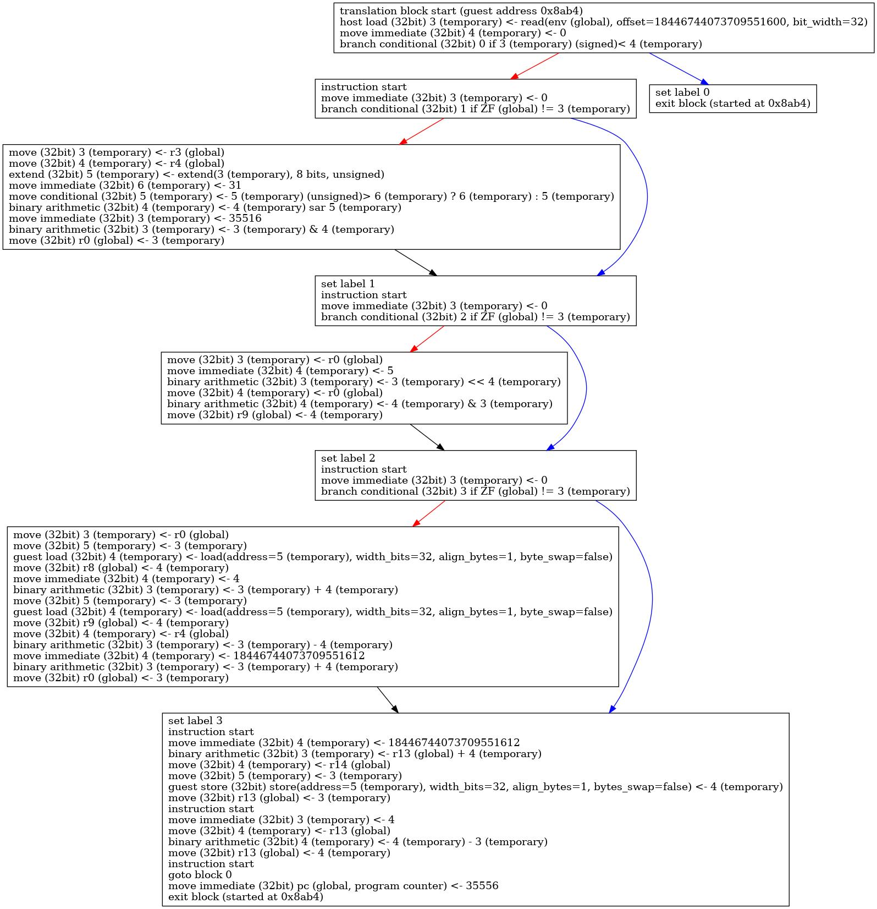

# kent_control_flow

School project in order to draw a dot diagram from generated pseudo asm instructions.

It takes as input a text file that contains pseudo asm instructions (Text files located in input_files directory is a sample of pseudo asm instructions given by my supervisor).

This school project does not show an innovative way to do something, the innovative part is the way the pseudo asm is generated (not my part).

I made an other version of this project that does not take a txt file as input but a tree of structure generated from the decompilation of binaries.
This version is not public at this moment because it uses a private library. Maybe it will become public one day.

Example on input:
```$xslt
translation block start (guest address 0x8ab4)
host load (32bit) 3 (temporary) <- read(env (global), offset=18446744073709551600, bit_width=32)
move immediate (32bit) 4 (temporary) <- 0
branch conditional (32bit) 0 if 3 (temporary) (signed)< 4 (temporary)
instruction start
move immediate (32bit) 3 (temporary) <- 0
branch conditional (32bit) 1 if ZF (global) != 3 (temporary)
move (32bit) 3 (temporary) <- r3 (global)
move (32bit) 4 (temporary) <- r4 (global)
...
```

Example of ouput:

